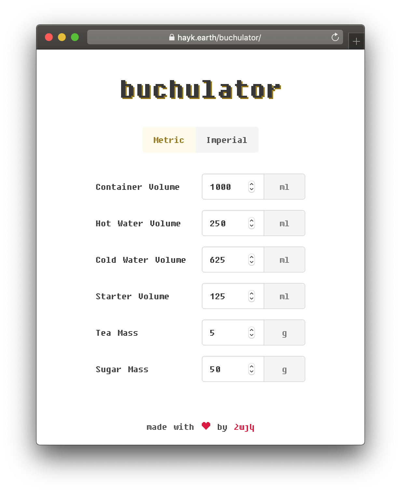

# buchulator

> kombucha calculator



## Installing

```bash
    git clone https://github.com/haykkh/buchulator-v2.git

    cd buchulator-v2

    yarn
```

## Development

```bash
yarn start
```

Access [localhost:1234](http://localhost:1234).

The browser will reload as you save new code. 🚀

### Build a release

```bash
    yarn build

```

## Meta

Hayk Khachatryan - [chat w/ me](https://chat.hayk.io) - hi@hayk.io

[github.com/haykkh](https://github.com/haykkh)

Based on [hyperapp-todo-simple](https://github.com/marcusasplund/hyperapp-todo-simple) by [marcusasplund](https://github.com/marcusasplund)

## License

Hyperapp One is MIT licensed. See [LICENSE](LICENSE).
